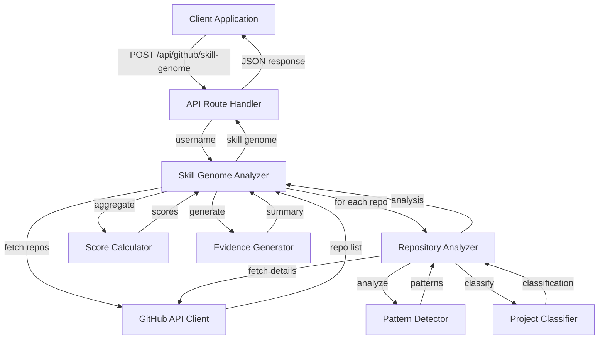

# Design Document: GitHub Skill Genome Analysis

## Overview

The GitHub Skill Genome Analysis feature is a sophisticated system that transforms a developer's GitHub profile into a comprehensive skill assessment. The system analyzes repository metadata, code structure, commit history, documentation quality, and architectural patterns to generate quantified skill scores across five technical domains, determine engineering maturity, and provide evidence-based insights.

### Key Design Principles

1. **Comprehensive Analysis**: Analyze all available repositories without arbitrary filtering to capture the complete skill profile
2. **Evidence-Based Scoring**: All scores must be traceable to specific code artifacts and patterns
3. **Weighted Aggregation**: Use domain-specific weights to balance different quality indicators
4. **Graceful Degradation**: Handle API failures and missing data without breaking the analysis
5. **Rate Limit Awareness**: Respect GitHub API constraints through intelligent sampling and optional authentication

### System Boundaries

**In Scope:**
- GitHub public repository analysis
- Code pattern and framework detection
- Commit history quality assessment
- Documentation maturity classification
- Skill score calculation and aggregation
- Engineering maturity determination

**Out of Scope:**
- Private repository analysis (requires OAuth flow)
- Real-time code execution or testing
- Plagiarism or code originality detection
- Team collaboration metrics
- Repository contribution attribution beyond commit authorship

## Architecture

### High-Level Architecture



### Component Interaction Flow

1. **Request Initiation**: Client sends GitHub username to API endpoint
2. **Repository Discovery**: GitHub API Client fetches all public repositories
3. **Repository Selection**: All repositories are sorted by update date (no filtering)
4. **Deep Analysis Loop**: For each repository:
   - Fetch file tree, README, commits, and source file samples
   - Detect architectural patterns from file structure
   - Identify frameworks from dependencies and imports
   - Analyze code quality indicators
   - Assess commit message quality
   - Classify documentation maturity
   - Calculate complexity score
   - Classify project type and primary domain
5. **Score Aggregation**: Calculate weighted domain scores across all repositories
6. **Maturity Assessment**: Determine engineering maturity from quality indicators
7. **Evidence Synthesis**: Generate strengths, gaps, and detailed explanations
8. **Response Formation**: Package results into structured JSON response

### Error Handling Strategy

- **Network Failures**: Retry with exponential backoff for transient errors
- **Rate Limiting**: Track rate limit headers and pause when approaching limits
- **Missing Data**: Use default values and continue analysis with available data
- **Repository Analysis Failures**: Log error and skip to next repository
- **Complete Failure**: Return empty skill genome with error metadata

## Components and Interfaces

### 1. API Route Handler

**Responsibility**: HTTP request validation and response formatting

**Interface**:
```javascript
POST /api/github/skill-genome
Request Body: { username: string }
Response: {
  success: boolean,
  data?: SkillGenomeResult,
  error?: string
}
```

**Validation**:
- Username must be non-empty string
- Username must not contain invalid characters

**Error Responses**:
- 400: Invalid request (missing or invalid username)
- 500: Analysis failure (with error message)

### 2. Skill Genome Analyzer

**Responsibility**: Orchestrate the complete analysis workflow

**Interface**:
```javascript
async function analyzeSkillGenome(username: string): Promise<SkillGenomeResult>
```

**Algorithm**:
1. Fetch all user repositories via GitHub API Client
2. If no repositories, return empty skill genome
3. Sort repositories by update date (most recent first)
4. For each repository, invoke Repository Analyzer
5. Collect all repository analyses
6. Invoke Score Calculator to compute domain scores
7. Invoke Maturity Assessor to determine engineering level
8. Invoke Technology Extractor to identify core technologies
9. Invoke Evidence Generator to create strengths/gaps summary
10. Invoke Explanation Generator to create detailed domain explanations
11. Package and return complete skill genome

**Dependencies**:
- GitHub API Client
- Repository Analyzer
- Score Calculator
- Evidence Generator

### 3. GitHub API Client

**Responsibility**: Interface with GitHub REST API v3

**Interface**:
```javascript
async function fetchUserRepos(username: string): Promise<Repository[]>
async function fetchRepositoryDetails(owner: string, repo: string): Promise<RepositoryDetails>
async function fetchFileTree(owner: string, repo: string): Promise<FileTreeNode[]>
async function fetchFileContent(owner: string, repo: string, path: string): Promise<string>
async function fetchReadme(owner: string, repo: string): Promise<string>
async function fetchCommitHistory(owner: string, repo: string, maxCommits: number): Promise<Commit[]>
```

**Authentication**:
- Optional GitHub token from environment variable `GITHUB_TOKEN`
- If token present, include in Authorization header as Bearer token
- If token absent, use unauthenticated requests (lower rate limits)

**Rate Limiting**:
- Unauthenticated: 60 requests/hour
- Authenticated: 5000 requests/hour
- Track `X-RateLimit-Remaining` header
- Implement exponential backoff when approaching limits

**Error Handling**:
- 404: User or repository not found
- 403: Rate limit exceeded
- 401: Invalid authentication token
- Network errors: Retry with backoff

### 4. Repository Analyzer

**Responsibility**: Perform deep analysis on a single repository

**Interface**:
```javascript
async function analyzeRepository(repo: Repository, username: string): Promise<RepositoryAnalysis>
```

**Analysis Steps**:
1. Fetch file tree structure
2. Detect architectural patterns from file paths
3. Fetch README content
4. Classify documentation maturity
5. Fetch commit history (up to 100 commits)
6. Analyze commit message quality
7. Sample source files (up to 10 files)
8. Analyze code quality indicators
9. Detect frameworks from dependencies and code
10. Calculate complexity score
11. Classify project type and primary domain

**Source File Sampling Strategy**:
- Priority 1: Configuration files (package.json, requirements.txt, go.mod, Gemfile, composer.json)
- Priority 2: Source code files (.js, .ts, .tsx, .jsx, .py, .java, .go, .rb, .php, .cs)
- Skip files larger than 100 KB
- Prefer medium-sized files (~5 KB) over very small or very large
- Maximum 10 files total per repository

**Dependencies**:
- GitHub API Client
- Pattern Detector
- Project Classifier

### 5. Pattern Detector

**Responsibility**: Identify architectural patterns, frameworks, and code quality indicators

**Interface**:
```javascript
function detectArchitecturalPatterns(fileTree: FileTreeNode[]): ArchitecturalPatterns
function detectFrameworks(files: SourceFile[]): Framework[]
function analyzeCodeQuality(sourceFiles: SourceFile[]): CodeQuality
function analyzeCommitMessages(commits: Commit[]): CommitQuality
function classifyDocumentationMaturity(readmeContent: string): DocumentationMaturity
```

**Architectural Pattern Detection**:
- **MVC Pattern**: Presence of controller/, model/, view/ directories
- **Microservice Pattern**: Presence of service/, api/, gateway/ directories
- **Layered Pattern**: Presence of routes/, services/, models/, data/ directories
- **Component-Based Pattern**: Presence of components/, containers/, pages/ directories
- **RESTful Pattern**: Presence of routes/, api/, endpoints/, controllers/ directories

Each pattern requires at least 2 matching directory/file indicators and is assigned a domain and score.

**Framework Detection**:
- **Frontend**: React, Vue, Angular (from package.json and import statements)
- **Backend**: Express, FastAPI, Django, Flask (from package.json/requirements.txt and imports)
- **ML/Data Science**: TensorFlow, PyTorch, scikit-learn, pandas, numpy (from requirements.txt and imports)

Each framework is assigned a domain, weight, and confidence score (0-1) based on pattern frequency.

**Code Quality Indicators**:
- **Error Handling**: try/catch/throw/except patterns (weight: 0.15, min count: 5)
- **Async Usage**: async/await/Promise/goroutine patterns (weight: 0.20, min count: 3)
- **Test Coverage**: test files and testing framework patterns (weight: 0.25, min count: 1)
- **Type Safety**: interface/type annotations (weight: 0.10, min count: 5)
- **Documentation**: JSDoc/docstring patterns (weight: 0.10, min count: 3)

**Commit Quality Metrics**:
- **Semantic Prefixes**: Percentage of commits with feat:/fix:/docs:/refactor:/test:/chore: prefixes
- **Conventional Commits**: Percentage following conventional commit format
- **Message Clarity**: Based on average message length (threshold: 20 characters)

**Documentation Maturity Levels**:
- **Beginner**: README missing or less than 100 characters (score: 0)
- **Intermediate**: README contains essential sections (install, usage) (score: 40-69)
- **Production-Grade**: README contains essential + advanced sections (API docs, architecture, contributing, examples, code blocks, images) (score: 70-100)

### 6. Project Classifier

**Responsibility**: Classify repository type, complexity, and primary domain

**Interface**:
```javascript
function classifyProject(analysis: RepositoryAnalysis): ProjectClassification
function calculateComplexityScore(analysis: RepositoryAnalysis): number
```

**Project Type Classification**:
- **web-application**: Frontend frameworks detected (React, Vue, Angular)
- **api-service**: Backend frameworks detected (Express, FastAPI, Django)
- **ml-pipeline**: ML frameworks detected (TensorFlow, PyTorch)
- **library**: No specific application framework detected

**Complexity Score Calculation** (0-100):
- File count: 20 points for >50 files, 30 points for >100 files
- Repository size: 15 points for >5 MB
- Architectural patterns: 10 points per detected pattern
- Code quality: Up to 50% of aggregate quality score
- Documentation: 20 points for production-grade, 10 for intermediate
- Commit activity: 15 points for >50 commits, 25 points for >100 commits
- Frameworks: 5 points per detected framework
- Maximum: 100 points

**Primary Domain Determination**:
1. Initialize domain scores to 0 for all five domains
2. For each detected framework: Add (weight × confidence × 30) to framework's domain
3. For each architectural pattern: Add pattern score to pattern's domain
4. For primary language: Add 10 points to language's typical domain
5. Select domain with highest score as primary domain
6. Calculate confidence as min(maxScore / 50, 1)

**Complexity Level**:
- **low**: Complexity score < 40
- **medium**: Complexity score 40-69
- **high**: Complexity score ≥ 70

### 7. Score Calculator

**Responsibility**: Aggregate repository analyses into domain skill scores

**Interface**:
```javascript
function calculateSkillScores(repositories: RepositoryAnalysis[]): DomainScores
function determineEngineeringMaturity(repositories: RepositoryAnalysis[]): MaturityLevel
```

**Skill Score Algorithm**:

For each repository, calculate weighted score:
1. **Code Structure (30%)**: (architecturalPatternCount × 10) / 30
2. **Frameworks (25%)**: min(sum(framework.weight × framework.confidence), 1)
3. **Commit Quality (20%)**: (semanticPrefixes + clarity) / 2
4. **Documentation (15%)**: documentationScore / 100
5. **Complexity (10%)**: complexityScore / 100

Total repository score = sum of weighted components

Add repository score to its primary domain, multiplied by classification confidence and scaled by 100.

After processing all repositories:
- Find maximum domain score
- Normalize all domains: (domainScore / maxScore) × 100
- Round to nearest integer

**Engineering Maturity Algorithm**:

For each repository, accumulate maturity points:
- Production-grade docs: +15 points
- Intermediate docs: +8 points
- Error handling detected: +10 points
- Async usage detected: +8 points
- Test coverage detected: +15 points
- Semantic commits >50%: +10 points
- Conventional commits >60%: +8 points
- 2+ architectural patterns: +12 points

Calculate average maturity score across all repositories.

Classification:
- **Advanced**: Average score ≥ 50
- **Intermediate**: Average score 25-49
- **Beginner**: Average score < 25

### 8. Evidence Generator

**Responsibility**: Generate strengths, gaps, and detailed explanations

**Interface**:
```javascript
function extractCoreTechnologies(repositories: RepositoryAnalysis[]): string[]
function generateEvidenceSummary(repositories: RepositoryAnalysis[]): EvidenceSummary
function generateExplanations(scores: DomainScores, repositories: RepositoryAnalysis[]): Explanations
```

**Core Technology Extraction**:
1. Count frequency of each primary language across repositories
2. Count frequency of each framework (weighted by confidence)
3. Sort technologies by frequency (descending)
4. Return top 10 technologies
5. Capitalize technology names for presentation

**Strengths Identification** (thresholds):
- Architectural patterns in >50% of repos
- Error handling in >70% of repos
- Async programming in >60% of repos
- Average semantic commits >50%
- Any production-grade documentation
- Average commits per repo >30

**Gaps Identification** (thresholds):
- No test coverage detected in any repo
- Test coverage in <30% of repos
- No production-grade documentation
- Average semantic commits <30%
- Architectural patterns in <30% of repos

**Explanation Generation**:

For each domain:
- If no relevant projects or score <10: State "No significant projects detected"
- Otherwise, include:
  - Domain score
  - Number of contributing repositories
  - Repository names
  - Detected architectural patterns
  - Detected technologies/frameworks
  - Average commit maturity percentage
  - Documentation quality breakdown (production-grade count vs intermediate/beginner)

## Data Models

### Repository

```typescript
interface Repository {
  name: string;
  html_url: string;
  description: string | null;
  language: string | null;
  size: number;              // KB
  created_at: string;        // ISO 8601
  updated_at: string;        // ISO 8601
  fork: boolean;
  stargazers_count: number;
  watchers_count: number;
  has_issues: boolean;
  default_branch: string;
}
```

### FileTreeNode

```typescript
interface FileTreeNode {
  path: string;
  type: 'blob' | 'tree';
  size: number;
  sha: string;
}
```

### SourceFile

```typescript
interface SourceFile {
  path: string;
  content: string;
  size: number;
}
```

### Commit

```typescript
interface Commit {
  sha: string;
  commit: {
    message: string;
    author: {
      name: string;
      email: string;
      date: string;
    };
  };
}
```

### ArchitecturalPatterns

```typescript
interface ArchitecturalPatterns {
  [patternName: string]: {
    matched: boolean;
    score: number;
    domain: PrimaryDomain;
    matchCount: number;
  };
}
```

### Framework

```typescript
interface Framework {
  name: string;
  domain: PrimaryDomain;
  weight: number;        // 0.15-0.30
  confidence: number;    // 0-1
}
```

### CodeQuality

```typescript
interface CodeQuality {
  errorHandling: QualityIndicator;
  asyncUsage: QualityIndicator;
  testCoverage: QualityIndicator;
  typing: QualityIndicator;
  documentation: QualityIndicator;
}

interface QualityIndicator {
  detected: boolean;
  count: number;
  score: number;        // 0-100
}
```

### CommitQuality

```typescript
interface CommitQuality {
  hasSemanticPrefixes: number;    // 0-1 (percentage)
  averageLength: number;
  clarity: number;                 // 0-1
  conventionalCommits: number;     // 0-1 (percentage)
}
```

### DocumentationMaturity

```typescript
interface DocumentationMaturity {
  level: 'beginner' | 'intermediate' | 'production-grade';
  score: number;        // 0-100
  detected: {
    essential: number;
    intermediate: number;
    advanced: number;
  };
  hasCodeBlocks: boolean;
  hasImages: boolean;
  wordCount: number;
}
```

### ProjectClassification

```typescript
interface ProjectClassification {
  type: 'web-application' | 'api-service' | 'ml-pipeline' | 'library';
  complexity: 'low' | 'medium' | 'high';
  primaryDomain: PrimaryDomain;
  confidence: number;    // 0-1
}
```

### RepositoryAnalysis

```typescript
interface RepositoryAnalysis {
  name: string;
  url: string;
  description: string | null;
  language: string | null;
  size: number;
  created_at: string;
  updated_at: string;
  fileTree: FileTreeNode[];
  fileCount: number;
  architecturalPatterns: ArchitecturalPatterns;
  readme: string;
  documentation: DocumentationMaturity;
  commitCount: number;
  commitQuality: CommitQuality;
  sourceFiles: SourceFile[];
  codeQuality: CodeQuality;
  frameworks: Framework[];
  complexityScore: number;
  classification: ProjectClassification;
}
```

### DomainScores

```typescript
interface DomainScores {
  'Backend Engineering': number;      // 0-100
  'Frontend Development': number;     // 0-100
  'Data Science': number;             // 0-100
  'Machine Learning': number;         // 0-100
  'System Design': number;            // 0-100
}
```

### EvidenceSummary

```typescript
interface EvidenceSummary {
  strengths: string[];
  gaps: string[];
}
```

### Explanations

```typescript
interface Explanations {
  'Backend Engineering': string;
  'Frontend Development': string;
  'Data Science': string;
  'Machine Learning': string;
  'System Design': string;
}
```

### SkillGenomeResult

```typescript
interface SkillGenomeResult {
  username: string;
  skill_genome: {
    primary_domains: DomainScores;
    engineering_maturity: 'Beginner' | 'Intermediate' | 'Advanced';
    core_technologies: string[];
    evidence_summary: EvidenceSummary;
    explanations: Explanations;
  };
  metadata: {
    analyzedRepos: number;
    totalRepos: number;
    analysisTimestamp: string;
    message?: string;
  };
}
```

### PrimaryDomain

```typescript
type PrimaryDomain = 
  | 'Backend Engineering'
  | 'Frontend Development'
  | 'Data Science'
  | 'Machine Learning'
  | 'System Design';
```

