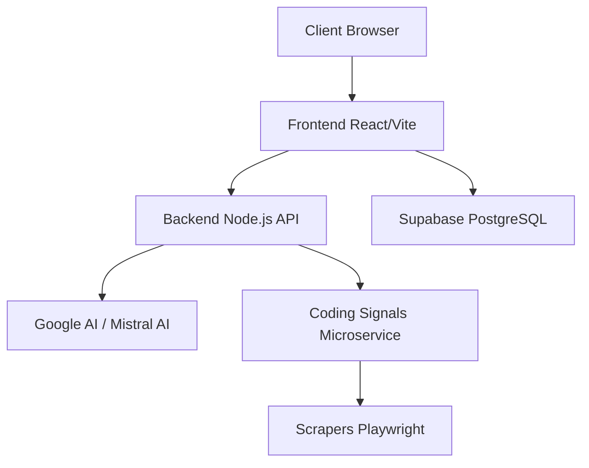

<div align="center">

# 🚀 ThinkRank

**Map Your Skills. Chart Your Path. Rank Higher.**


[](https://reactjs.org/)
[](https://www.typescriptlang.org/)
[](https://fastapi.tiangolo.com/)
[](https://tailwindcss.com/)
[](LICENSE)

*An AI-powered platform that creates a living genome map of your skills, provides personalized learning roadmaps, and accelerates your career growth.*

[Explore Features](#-features) · [Quick Start](#-quick-start) · [Report Bug](#-contributing) · [Request Feature](#-roadmap)

</div>


## ✨ Features

<details>
<summary><b>🧬 Skill Genome Mapping</b></summary>
<br>

- **AI-Powered Analysis**: Extract and analyze skills from GitHub profiles or resume uploads.
- **Interactive Visualizations**: D3.js-powered skill network graphs and heatmaps.
- **Weakness Detection**: Identify skill gaps with AI precision and priority ranking.
- **Industry Benchmarks**: Compare your skills against industry standards.
</details>

<details>
<summary><b>🗺️ Personalized Learning Roadmaps</b></summary>
<br>

- **Curated Learning Paths**: Structured roadmaps for different tech stacks (Frontend, Backend, AI/ML, etc.).
- **Progress Tracking**: Visual progress indicators with node-based milestones.
- **Topic-Based Learning**: Organized topics with estimated completion times.
- **Status Management**: Track completed, active, and locked learning nodes.
</details>

<details>
<summary><b>📊 Coding Signals</b></summary>
<br>

- **Multi-Platform Integration**: LeetCode, CodeChef, Codeforces, HackerRank.
- **Performance Analytics**: Track ratings, submissions, and problem-solving stats.
- **Activity Heatmaps**: GitHub-style contribution tracking.
</details>

<details>
<summary><b>🎯 Daily Tasks & Growth</b></summary>
<br>

- **Personalized Micro-Tasks**: 15-30 minute daily exercises tailored to your gaps.
- **Streak Tracking**: Gamified consistency with streak rewards.
- **Progress Dashboard**: Monitor your skill evolution over time.
</details>

<details>
<summary><b>💼 Interview Prep</b></summary>
<br>

- **MNC Interview Mode**: Practice with company-specific question patterns.
- **AI-Powered Feedback**: Get real-time feedback on your responses.
- **Skill-Based Questions**: Questions tailored to your skill profile.
</details>

---

## 🎨 Tech Stack

<div align="center">
  
</div>

<br>

| Layer | Technologies |
|-------|-------------|
| **Frontend** | React 18, TypeScript, Vite, Tailwind CSS, shadcn/ui, Framer Motion |
| **Visualization** | D3.js, Cytoscape.js, Recharts |
| **Backend** | Node.js, Express.js |
| **Database** | Supabase (PostgreSQL) |
| **AI Services** | Google Generative AI, Mistral AI |
| **Coding Signals** | Python, FastAPI, Playwright |

---

## 🏗️ Architecture



<details>
<summary><b>View Folder Structure</b></summary>
<br>

```text
ThinkRank/
├── 🌐 frontend/          # React + Vite + TypeScript
│   ├── src/
│   │   ├── components/   # Reusable UI components
│   │   ├── pages/        # Route components
│   │   ├── contexts/     # React contexts
│   │   ├── hooks/        # Custom React hooks
│   │   ├── data/         # Static data
│   │   └── lib/          # Utilities
│   └── public/           # Static assets
├── ⚙️ backend/           # Node.js + Express API
│   ├── src/
│   │   ├── routes/       # API endpoints
│   │   ├── services/     # Business logic
│   │   └── config/       # Configuration
│   └── sql/              # Database schemas
└── 🐍 coding_signals/    # Python FastAPI Microservice
    ├── scrapers/         # Platform-specific scrapers
    ├── normalization/    # Data processing
    └── utils/            # Shared utilities
```
</details>

---

## 🚀 Quick Start

### Prerequisites
- **Node.js** 18+
- **Python** 3.9+
- **npm** or **yarn**

### 1️⃣ Clone the Repository
```bash
git clone https://github.com/Himanshusolanki24/ThinkRank.git
cd ThinkRank
```

### 2️⃣ Start the Frontend
```bash
cd frontend
npm install
npm run dev
# → http://localhost:5173
```

### 3️⃣ Start the Backend
```bash
cd backend
npm install
npm run dev
# → http://localhost:3001
```

### 4️⃣ Start Coding Signals Engine (Optional)
```bash
cd coding_signals
pip3 install -r requirements.txt
playwright install chromium
python3 -m uvicorn main:app --reload --port 8000
# → http://localhost:8000
```

---

## 🔧 Environment Variables

<details>
<summary><b>Frontend (.env)</b></summary>
<br>

```env
VITE_SUPABASE_URL=your_supabase_url
VITE_SUPABASE_ANON_KEY=your_supabase_anon_key
VITE_API_URL=http://localhost:3001
```
</details>

<details>
<summary><b>Backend (.env)</b></summary>
<br>

```env
SUPABASE_URL=your_supabase_url
SUPABASE_ANON_KEY=your_supabase_key
GOOGLE_AI_API_KEY=your_google_ai_key
MISTRAL_API_KEY=your_mistral_api_key
```
</details>

---

## 🔌 API Endpoints

### Backend (Port 3001)
| Method | Endpoint | Description |
|--------|----------|-------------|
| 🟢 `GET` | `/api/health` | Health check |
| 🔵 `POST` | `/api/auth/login` | User authentication |
| 🔵 `POST` | `/api/extract-skills/github` | Extract skills from GitHub |
| 🔵 `POST` | `/api/extract-skills/resume` | Extract skills from resume |
| 🟢 `GET` | `/api/daily-tasks` | Get personalized daily tasks |
| 🔵 `POST` | `/api/interview/start` | Start interview session |

### Coding Signals (Port 8000)
| Method | Endpoint | Description |
|--------|----------|-------------|
| 🟢 `GET` | `/health` | Health check |
| 🔵 `POST` | `/coding-signals/fetch` | Fetch coding platform data |
| 🟢 `GET` | `/platforms` | List supported platforms |

---

## 🤝 Contributing

1. Fork the repository
2. Create your feature branch: `git checkout -b feature/AmazingFeature`
3. Commit your changes: `git commit -m 'Add AmazingFeature'`
4. Push to the branch: `git push origin feature/AmazingFeature`
5. Open a Pull Request

---

## 📝 License

This project is licensed under the MIT License - see the [LICENSE](LICENSE) file for details.

---

## 🗺️ Roadmap

- [x] 🧬 Skill Genome Mapping
- [x] 🗺️ Personalized Learning Roadmaps
- [x] 📊 Coding Signals Integration
- [x] 💼 MNC Interview Mode
- [ ] 📱 Mobile App Development
- [ ] 👥 Team Skill Analysis
- [ ] 🎓 Skill Certification System
- [ ] 🤖 AI Career Coaching

---

<div align="center">

**Built with ❤️ for developers who want to evolve their skills continuously.**

*"Your skill evolution engine powered by AI"*

[⬆ Back to Top](#-thinkrank)

</div>
